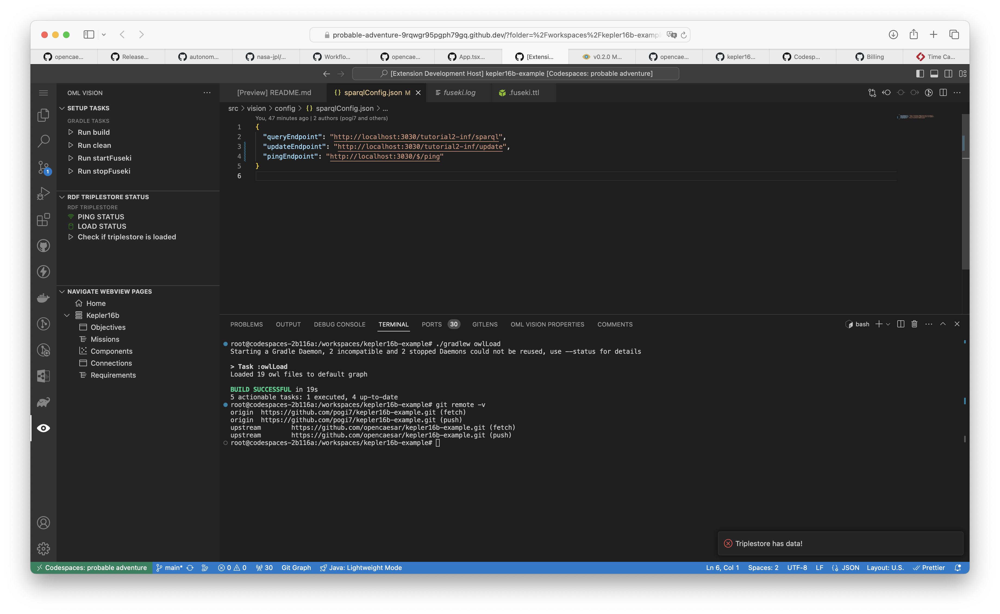

# Commands

The config or configuration directory contains the configuration the following API endpoints for the in-memory [Fuseki](https://jena.apache.org/documentation/fuseki2/) RDF triplestore:

- query
- update
- ping

<!-- TODO: Change example to opencaesar organization -->
An example of a config directory correctly formatted for OML Vision can be seen [here](https://github.com/pogi7/kepler16b-example/blob/main/src/vision/config/sparqlConfig.json)

## sparqlConfig.json

:::info sparqlConfig.json

Create a `src/vision/config/sparqlConfig.json` file (case-sensitive)

:::

The `src/vision/config/sparqlConfig.json` file is responsible for specifying the query and update API endpoints.

It is formatted as a JSON data structure.

<!-- TODO: Change to opencaesar repo -->
An example of what this looks like is seen below with the source code found [here](https://github.com/pogi7/kepler16b-example/blob/main/src/vision/config/sparqlConfig.json)


### queryEndpoint

:::danger REQUIRED

```typescript
queryEndpoint: string
```

:::

This string defines the API query endpoint of the in-memory RDF triplestore.  

#### Fuseki

<!-- TODO: Change to opencaesar repo -->
This endpoint can usually be found within the `.fuseki.ttl` file under the `sparql` service.  An example of how to specify this endpoint can be found [here](https://github.com/pogi7/kepler16b-example/blob/main/.fuseki.ttl#L15)

### updateEndpoint
:::danger REQUIRED

```typescript
updateEndpoint: string
```

:::

This string defines the API update endpoint of the in-memory RDF triplestore.  

#### Fuseki

<!-- TODO: Change to opencaesar repo -->
This endpoint can usually be found within the `.fuseki.ttl` file under the `update` service.  An example of how to specify this endpoint can be found [here](https://github.com/pogi7/kepler16b-example/blob/main/.fuseki.ttl#L14)

### pingEndpoint
:::danger REQUIRED

```typescript
pingEndpoint: string
```

:::

This string defines the API ping endpoint of the in-memory RDF triplestore.  

#### Fuseki

You can refer to refer to the [Fuseki HTTP Server Protocol](https://jena.apache.org/documentation/fuseki2/fuseki-server-protocol.html) for an example of an in-memory RDF triplestore with a pingable endpoint.

## Triplestore Status

### Ping Status

The ping status of the RDF triplestore is shown at all times in OML Vision in the `RDF Triplestore Status` sidebar window.  It indicates whether the triplestore is running or not.

RDF Triplestore On Icon = 

RDF Triplestore Off Icon = 

### Load Status

The load status of the RDF triplestore is shown at all times in OML Vision in the `RDF Triplestore Status` sidebar window.  It indicates whether data has been loaded into the triplestore or not.

RDF Triplestore Loaded Icon = 

RDF Triplestore Not Loaded Icon = 

:::info Check if triplestore is loaded button

The concept of operations for checking the loaded status of a triplestore is

1. Start the server (usually with a gradle task).  Refer to gradle section [here](docs/api-documentation/gradle).  DO NOT LOAD DATA UNTIL STEP 4.
2. Run the `Check if triplestore is loaded` button
3. If the RDF Triplestore Loaded Icon =  then you have verified that data is loaded into the triplestore.  You may skip the next steps.
4. If RDF Triplestore Not Loaded Icon =  then you must load data into the triplestore (usually with a gradle task).  Refer to gradle section [here](docs/api-documentation/gradle).
5. Afterwards the RDF Triplestore Loaded Icon = . You have verified that data is loaded into the triplestore.

:::

### Sidebar Example

An example of how the `RDF Triplestore Status` sidebar window looks like is shown below.

