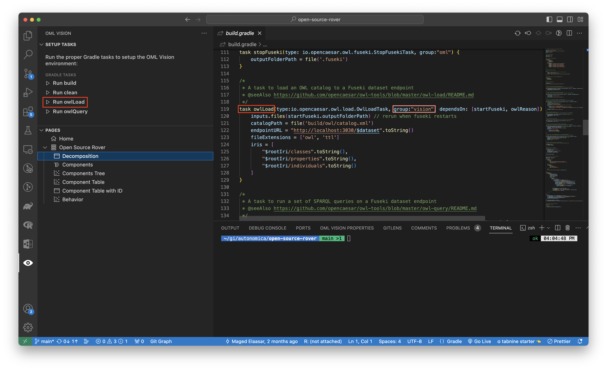

# Gradle

OML models tend to use Gradle to package dependencies and tasks to manipulate and analyze the model.

:::danger Gradle for Java VSCode Extension

OML Vision requires the [Gradle for Java](https://marketplace.visualstudio.com/items?itemName=vscjava.vscode-gradle) VSCode extension.  

Read more installation instructions [here](docs/intro#what-youll-need)

:::

## Build

:::info build.gradle

Create a `build.gradle` file (case-sensitive)

:::

In OML Vision, the `build.gradle` file is responsible for: 

- Defining tasks to run in OML Vision
- Listens on the `build.gradle` file for any changes.  

Examples of correctly formatted `build.gradle` files for OML Vision are found here:

- [Kepler16b build.gradle](https://github.com/pogi7/kepler16b-example/blob/main/build.gradle)
- [Open Source Rover build.gradle](https://github.com/UTNAK/open-source-rover/blob/main/build.gradle)

You can read more about `build.gradle` files [here](https://docs.gradle.org/current/userguide/build_file_basics.html)

## Tasks

A task in Gradle refers to some command or program that Gradle executes.

Generally OML Vision only requires 5 tasks:

- clean (Removes build folder)
- build (Constructs OWL and OML files)
- startFuseki (starts RDF triplestore)
- owlLoad (Loads OWL data into RDF triplestore)
- stopFuseki (stops RDF triplestore)

### Vision Group

OML Vision is asynchronously listening in the `build.gradle` for any changes to the tasks.  OML Vision will display any task in the `vision` group in the sidebar.

:::note REGISTERING NEW GRADLE TASKS

New tasks will register once you deactivate then reactive OML Vision.  You can do this by clicking the [File Explorer](https://code.visualstudio.com/docs/getstarted/userinterface#_explorer) then clicking the OML Vision extension icon.

:::

**By default, OML Vision displays the `clean` and `build` tasks.  Those tasks do not need to be within the `vision` Gradle group.**

:::tip USER INTERFACE

The `vision` gradle corresponds to the `Setup Tasks` section in OML Vision shown in the red boxes.

:::

### Running Tasks

You may run tasks in OML Vision either 

- By clicking the `Run Task` button in the OML Vision extension under the `Setup Tasks` section 
- Running the task using the Gradle wrapper in any terminal.
  - An example of this would be running `./gradlew clean`