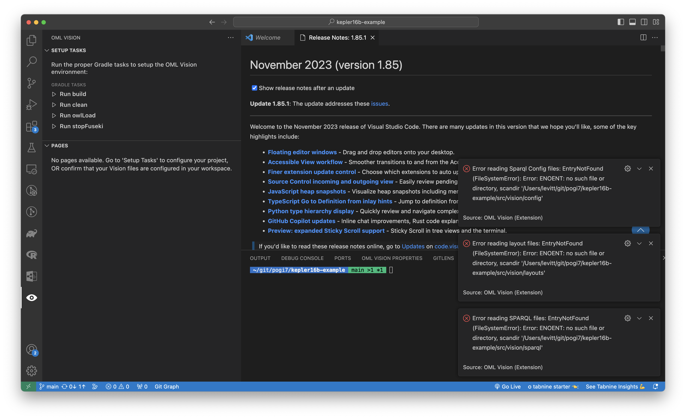

# Required Directories

## Config

Create a `src/vision/config` directory

It contains the configuration for the update and query API endpoint for the in-memory [Fuseki](https://jena.apache.org/documentation/fuseki2/) RDF triplestore.

Detailed information about the config directory can be found [here](/docs/api-documentation/config)

## Viewpoints

Create a `src/vision/viewpoints` directory

It contains the specification needed for OML Vision to format the different views (i.e. Table, Tree, Diagram, etc.) that are rendered by the extension.

Detailed information about the viewpoints directory can be found [here](/docs/category/viewpoints)

## Sparql

Create a `src/vision/sparql` directory

It contains the definitions for the updates and queries that will be sent to the in-memory RDF triplestore.

Detailed information about the config directory can be found [here](/docs/api-documentation/sparql)

:::danger Required Directories

The following directories are required for OML Vision to work properly.

- `src/vision/config`
- `src/vision/viewpoints`
- `src/vision/sparql`

An error like this will occur without those directories

:::
