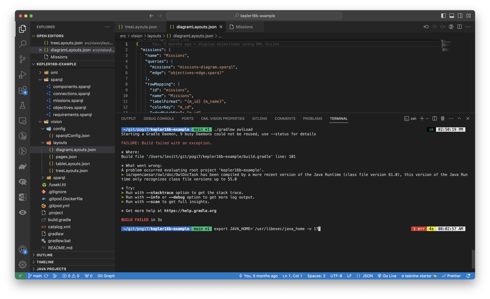
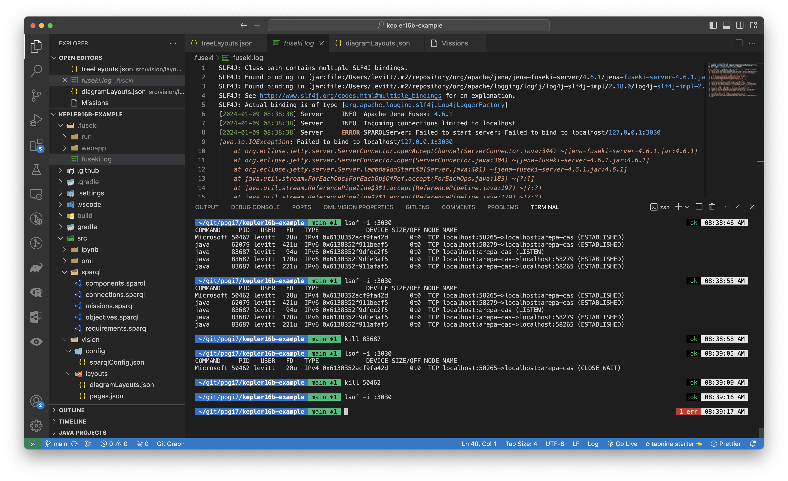

# Troubleshooting

Feel free to contact the OML Vision contributors for troubleshooting information if this guide does not suffice.

[Contact Us](https://www.opencaesar.io/contributors/)

:::tip FUESKI LOGS

If using Fuseki for the RDF Triplestore, logs are usually created in the `.fuseki/fuseki.log` directory.

:::

## Incorrect Java Version

Some OML models may specify a specific version of Java.  For example, the Kepler16b OML Model only supports Java 17 or higher.  

To fix this update Java to the correct version.

Helpful guide for updating Java version for Windows and macOS [here](https://www.baeldung.com/java-home-on-windows-mac-os-x-linux)

:::tip USER INTERFACE

Updating the Java version on macOS within VSCode may look like this.

:::

## Fuseki RDF Triplestore port already in use

By default, the Fuseki RDF triplestore uses port `3030`.  If this port is already in use, you will need to kill it in order for data to be loaded into the triplestore.

:::tip USER INTERFACE

Killing the `3030` port using macOS within VSCode may look like this.

:::

### Windows

**Use port 3030**

Follow this guide to kill a port on a Windows found [here](https://sentry.io/answers/kill-process-using-port-in-windows/)

### macOS

**Use port 3030**

Follow this guide to kill a port on a macOS found [here](https://stackoverflow.com/questions/3855127/find-and-kill-process-locking-port-3000-on-mac)

