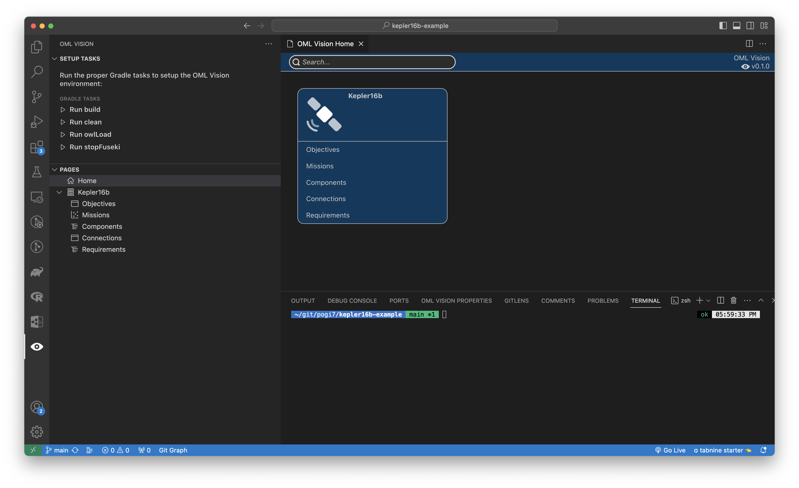
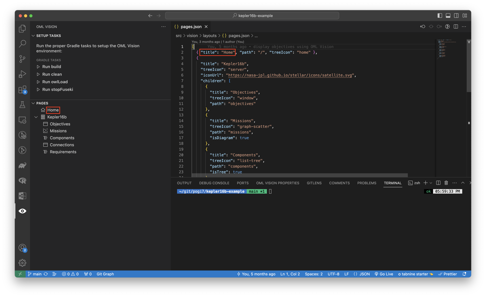
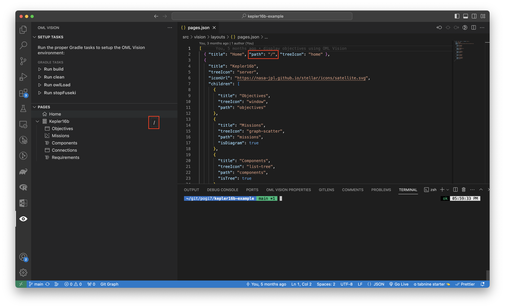
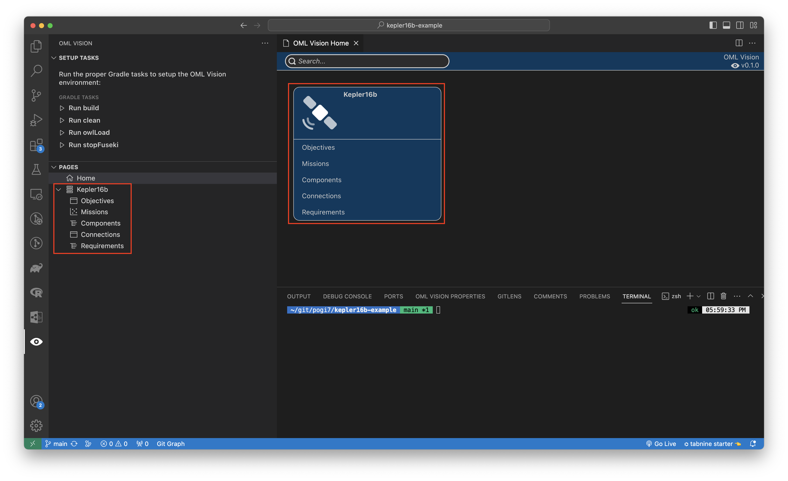
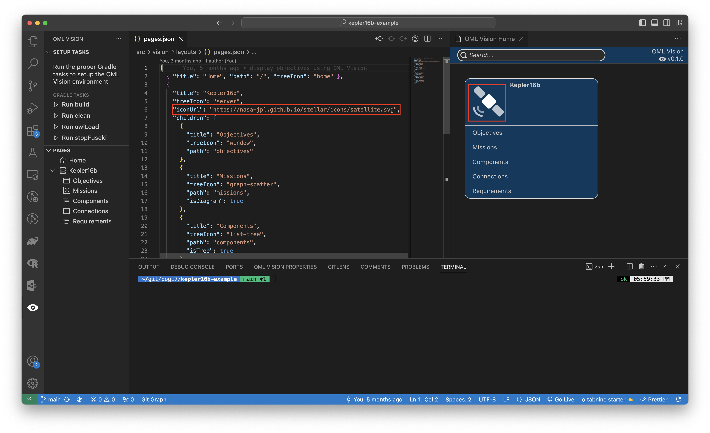
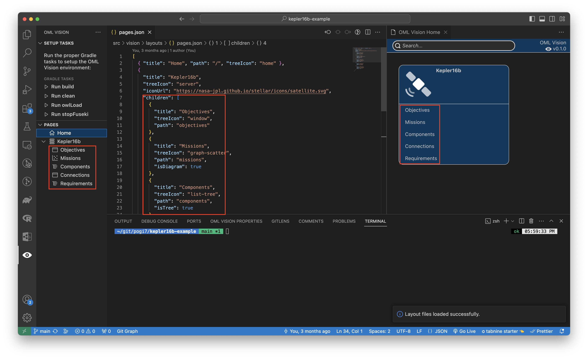

# Pages

:::info pages.json

Create a `src/vision/viewpoints/pages.json` file (case-sensitive)

:::

The `src/vision/viewpoints/pages.json` file is responsible for: 

- Defining what OML Vision can render
  - Home Page
    - Titles
    - Icons
  - Sidebar
    - Titles
    - Icons
  - Child Pages
    - Titles
    - Table, Tree, or Diagram
    - Icons
- Defining the path to the content that OML Vision renders

It is formatted as a JSON data structure.

<!-- TODO: Change to opencaesar repo -->
An example of what this looks like is seen below with the source code found [here](https://github.com/pogi7/kepler16b-example/blob/main/src/vision/viewpoints/pages.json)

## Home Page

The home page acts as an entry point for users to navigate through the pages that OML Vision renders.



### title
:::danger REQUIRED

```typescript
title: string
```

:::


This string defines the title of the home page.  A good name for the home page is "Home" or "Frontpage"

:::tip USER INTERFACE

The name of the `title` is rendered in the sidebar for the OML Vision extension shown in the red boxes.



:::

### path
:::danger REQUIRED

```typescript
path: string
```

:::


This string defines the path of the page. 

**For the `Home Page` the path must be `/`**

:::tip USER INTERFACE

The name of the `path` is rendered in the sidebar when you hover and hold for 2 seconds over the `Home Page` in the OML Vision extension shown in the red boxes.



:::

### type
:::danger REQUIRED

```typescript
type: string
```

:::


This string defines the type of the webview to be rendered. 

The type of webview determines the icon that is rendered in the sidebar.

**The icons that are rendered come from [here](https://code.visualstudio.com/api/references/icons-in-labels#icon-listing).**

:::tip TYPES

These are the current types
1. `home` -  This type renders the Home Page.
2. `group` - This type groups webviews together in the Home Page and sidebar. Grouping is only done in the UI.
3. `table` - This type specifies the webview to render a table.  For more info, look [here](/docs/api-documentation/viewpoints/tables.md)
4. `tree` - This type specifies the webview to render a tree.  For more info, look [here](/docs/api-documentation/viewpoints/trees.md)
5. `diagram` - This type specifies the webview to render a diagram.  For more info, look [here](/docs/api-documentation/viewpoints/diagrams.md)

:::

## Child Pages

Child pages are pages that are grouped with other similar pages.  The paths to these pages are rendered in the sidebar and in the `Home Page` shown in the red boxes.

**OML Vision supports more than 1 child page.**



### title
:::danger REQUIRED

```typescript
title: string
```

:::


This string defines the title of the child page.

:::tip USER INTERFACE

The name of the `title` is rendered in the sidebar and in the `Home Page`.

:::

### type
:::danger REQUIRED

```typescript
type: string
```

:::


This string defines the type of the webview to be rendered. 

The type of webview determines the icon that is rendered in the sidebar.

**The icons that are rendered come from [here](https://code.visualstudio.com/api/references/icons-in-labels#icon-listing).**

:::tip TYPES

These are the current types
1. `home` -  This type renders the Home Page.
2. `group` - This type groups webviews together in the Home Page and sidebar. Grouping is only done in the UI.
3. `table` - This type specifies the webview to render a table.  For more info, look [here](/docs/api-documentation/viewpoints/tables.md)
4. `tree` - This type specifies the webview to render a tree.  For more info, look [here](/docs/api-documentation/viewpoints/trees.md)
5. `diagram` - This type specifies the webview to render a diagram.  For more info, look [here](/docs/api-documentation/viewpoints/diagrams.md)

:::

### iconUrl
:::danger REQUIRED

```typescript
iconUrl: string
```

:::


This string defines the path of the icon that is rendered in the home page. 

**Supported image file formats are .svg, .png, or .jpg**

:::tip USER INTERFACE

The `Child Page` icon of the `iconUrl` is rendered in the `Home Page` in the OML Vision extension shown in the red boxes.



:::

### children
:::danger REQUIRED

```typescript
children: {
    title: string;
    path: string;
    type: string;
  }[];
```

:::


This `children` array of objects defines the `title`, `path`, and `type` of the `Child Page`. 

**You can more than one `Child Page` in the `children` array.**

**By default all child pages are rendered as tables unless specified with the isTree or isDiagram booleans.**

:::tip USER INTERFACE

The `Child Pages` are rendered in the sidebar and in the `Home Page` of the OML Vision extension shown in the red boxes.



:::

#### title
:::danger REQUIRED

```typescript
title: string
```

:::


This string defines the title of the child page.

:::tip USER INTERFACE

The name of the `title` of the `Child Page` is rendered in the sidebar and in the `Home Page` of the OML Vision extension.

:::

#### path
:::danger REQUIRED

```typescript
path: string
```

:::


This string defines the path of the `Child Page`. 

**Remember this string as it will be needed for the viewpoints of the tables, trees, and diagrams**

:::tip USER INTERFACE

The name of the `path` is rendered in the sidebar when you hover and hold for 2 seconds over the `Child Page` in the OML Vision extension.

:::

#### type
:::danger REQUIRED

```typescript
type: string
```

:::


This string defines the type of the webview to be rendered. 

The type of webview determines the icon that is rendered in the sidebar.

**The icons that are rendered come from [here](https://code.visualstudio.com/api/references/icons-in-labels#icon-listing).**

:::tip TYPES

These are the current types
1. `home` -  This type renders the Home Page.
2. `group` - This type groups webviews together in the Home Page and sidebar. Grouping is only done in the UI.
3. `table` - This type specifies the webview to render a table.  For more info, look [here](/docs/api-documentation/viewpoints/tables.md)
4. `tree` - This type specifies the webview to render a tree.  For more info, look [here](/docs/api-documentation/viewpoints/trees.md)
5. `diagram` - This type specifies the webview to render a diagram.  For more info, look [here](/docs/api-documentation/viewpoints/diagrams.md)

:::